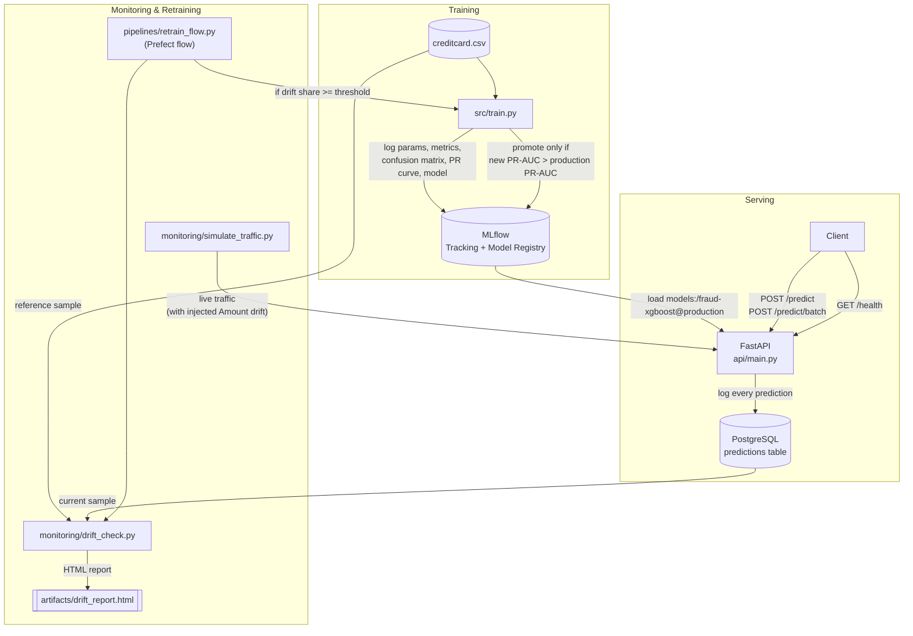
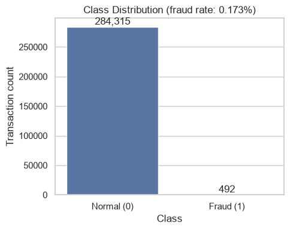
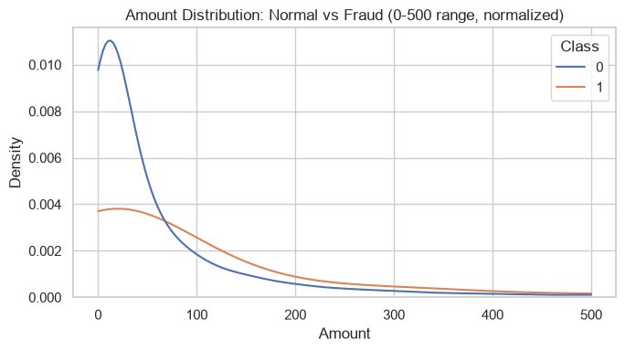
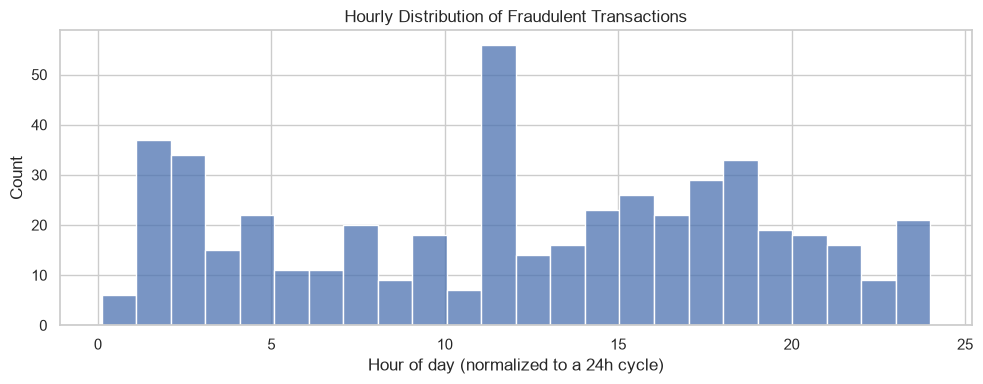
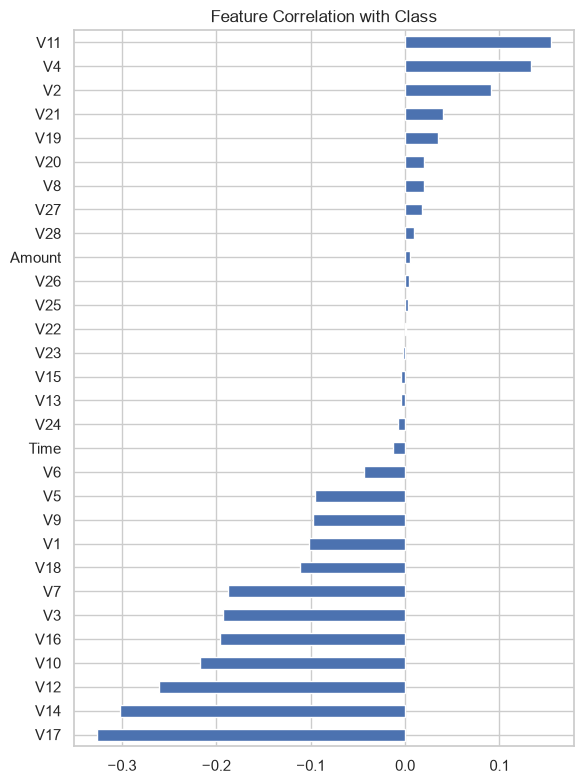
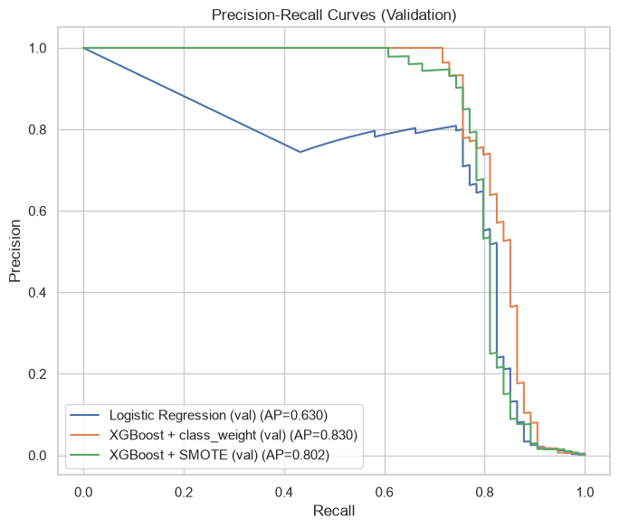
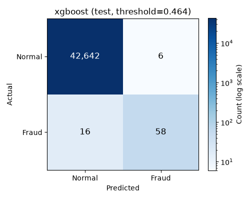
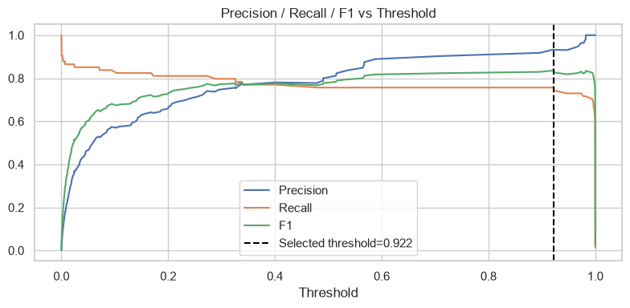
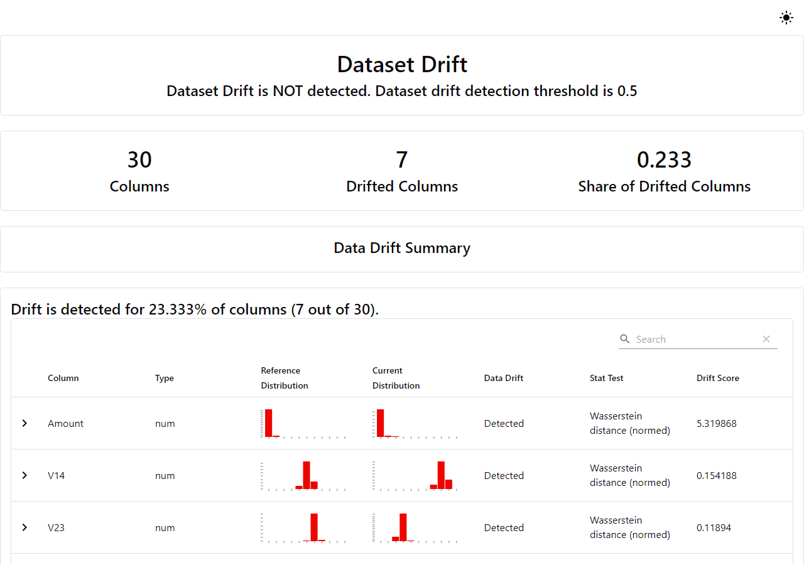

# Real-Time Credit Card Fraud Detection


An end-to-end MLOps pipeline built around the Kaggle [Credit Card Fraud
Detection](https://www.kaggle.com/mlg-ulb/creditcardfraud) dataset (~285K
transactions, ~0.17% fraud). The model itself (XGBoost) is deliberately
simple — the point of this project is everything **around** the model:
experiment tracking, a model registry, a served API with database logging,
data-drift monitoring, and automated, gated retraining, all wired into
CI/CD.

## Contents

- [Architecture](#architecture)
- [Tech stack](#tech-stack)
- [Project structure](#project-structure)
- [Getting started](#getting-started)
- [API reference](#api-reference)
- [Exploratory data analysis](#exploratory-data-analysis)
- [Model results](#model-results)
- [Drift monitoring & automated retraining](#drift-monitoring--automated-retraining)
- [Design decisions](#design-decisions)
- [Known limitations](#known-limitations)
- [Future improvements](#future-improvements)

## Architecture



## Tech stack

| Layer | Tools |
|---|---|
| Model | scikit-learn, XGBoost, imbalanced-learn |
| Experiment tracking & registry | MLflow |
| Serving | FastAPI, Pydantic, Uvicorn |
| Storage | PostgreSQL (prediction logs + MLflow backend store) |
| Orchestration | Prefect |
| Monitoring | Evidently |
| Quality | pytest, ruff |
| Packaging & CI | Docker, Docker Compose, GitHub Actions |

## Project structure

```
fraud-detection-mlops/
├── data/                 creditcard.csv (not committed)
├── notebooks/            EDA and baseline model comparison
├── src/                  config, data loading/splitting, features, training, evaluation
├── api/                  FastAPI app, Pydantic schemas, DB logging
├── pipelines/            Prefect retraining flow
├── monitoring/           traffic simulation + Evidently drift check
├── tests/                pytest suite (synthetic data only, no CSV dependency)
├── .github/workflows/    CI: lint + test + docker build
├── Dockerfile
├── docker-compose.yml    postgres + mlflow + api
├── requirements.txt      runtime dependencies
├── requirements-dev.txt  + pytest, ruff, jupyter
└── Makefile
```

## Getting started

Prerequisites: Python 3.11, Docker + Docker Compose (for the full stack),
and the dataset placed at `data/creditcard.csv`.

### Local development

```bash
make setup   # creates .venv, installs requirements-dev.txt
make train   # trains candidates, logs to MLflow, registers + promotes the best one
make test    # pytest
make lint    # ruff
make serve   # runs the API locally with --reload (needs MLflow + Postgres reachable)
```

### Full stack via Docker Compose

```bash
make up      # docker compose up --build  (postgres, mlflow, api)

# in another terminal, register a model into the running MLflow server:
MLFLOW_TRACKING_URI=http://localhost:5000 python -m src.train

# the API only reads the registry at startup, so tell it to pick up the new model:
curl -X POST http://localhost:8000/admin/reload-model
```

The API starts even with no model registered yet — `/health` reports
`model_loaded: false` and `/predict` returns `503` until the first
`src.train` run promotes a model to the `production` alias.

> **Note:** the Docker Compose stack and the Postgres-backed parts of the
> monitoring loop were written and reviewed carefully, but could not be run
> end-to-end in the development sandbox (no Docker or Postgres were
> available there). Component logic (API routes, drift computation,
> retraining gate) is unit-tested; please smoke-test `make up` on first run.

### Drift monitoring and retraining

```bash
make drift    # simulates traffic (with injected drift) against the running API, then checks drift
make retrain  # runs the Prefect retraining flow (drift check -> conditional retrain -> promote)
```

## API reference

| Method | Endpoint | Description |
|---|---|---|
| `GET` | `/health` | Model + database status |
| `POST` | `/predict` | Score a single transaction |
| `POST` | `/predict/batch` | Score a list of transactions |
| `POST` | `/admin/reload-model` | Re-read the `production` alias from the registry without restarting |

`POST /predict` request/response example:

```jsonc
// request
{ "Time": 0, "V1": -1.36, "V2": -0.07, /* ... V3-V28 ... */, "Amount": 149.62 }

// response
{ "prediction": 0, "fraud_probability": 0.0013, "threshold": 0.4641, "model_version": "1" }
```

Interactive docs are available at `/docs` (Swagger UI) once the API is running.

## Exploratory data analysis

Full notebook: [`notebooks/01_eda_baseline.ipynb`](notebooks/01_eda_baseline.ipynb).

<table>
<tr>
<td width="50%"></td>
<td width="50%"></td>
</tr>
<tr>
<td align="center"><sub>Fraud is only 0.17% of all transactions</sub></td>
<td align="center"><sub>Amount overlaps heavily between classes — not a strong signal on its own</sub></td>
</tr>
<tr>
<td width="50%"></td>
<td width="50%"></td>
</tr>
<tr>
<td align="center"><sub>Fraud isn't uniformly distributed across the day</sub></td>
<td align="center"><sub>V14, V17, V12, V10, V11, V4 carry most of the signal</sub></td>
</tr>
</table>

## Model results

Stratified 70/15/15 split, fixed seed (`RANDOM_STATE=42`). Accuracy is
never used — with ~0.17% positives it is meaningless.

<table>
<tr>
<td width="50%"></td>
<td width="50%"></td>
</tr>
<tr>
<td align="center"><sub>XGBoost + scale_pos_weight beats both alternatives on PR-AUC</sub></td>
<td align="center"><sub>Test set, log-scaled color, at the F1-optimal threshold</sub></td>
</tr>
</table>

| Model | Val PR-AUC | Test PR-AUC | Precision | Recall | F1 |
|---|---|---|---|---|---|
| Logistic Regression (class_weight=balanced) | 0.630 | — | — | — | — |
| XGBoost + SMOTE | 0.802 | — | — | — | — |
| **XGBoost + scale_pos_weight (selected)** | **0.833** | **0.840** | **0.906** | **0.784** | **0.841** |

Only the winning candidate is ever evaluated on the test set — evaluating
every candidate there would leak test-set information into model selection
— so the other rows only have validation numbers. SMOTE was compared in the
EDA notebook only; since it didn't beat `scale_pos_weight` there, it isn't
one of the two candidates `src/train.py` trains in production.



The default 0.5 threshold is rarely optimal on imbalanced data — the
selected model uses the F1-optimal threshold (~0.46) found on the
validation set instead.

## Drift monitoring & automated retraining

1. `monitoring/simulate_traffic.py` sends a batch of normal transactions
   through the live API, then a second batch with `Amount` deliberately
   scaled and shifted (`Amount * 8 + 500`) to simulate a real-world shift
   (e.g. a fraud ring, a merchant category change, a currency mismatch).
2. `monitoring/drift_check.py` compares a reference sample (from the
   original training data) against the most recently logged live
   predictions (read back from the `predictions` table in Postgres) using
   [Evidently](https://www.evidentlyai.com/)'s `DataDriftPreset`. It writes
   an HTML report to `artifacts/drift_report.html` and returns a summary:
   `dataset_drift`, `share_of_drifted_columns`, `number_of_drifted_columns`.
3. `pipelines/retrain_flow.py` (a Prefect flow) automates the decision: if
   `share_of_drifted_columns >= DRIFT_SHARE_THRESHOLD` (0.3, in
   `src/config.py`), it retrains the model and promotes the new version to
   `production` **only if** its test PR-AUC beats the current production
   model's — otherwise it stays on the current model and logs why.

<p align="center"></p>
<p align="center"><sub>Actual Evidently report: injecting the Amount drift (<code>Amount * 8 + 500</code>) into a real held-out sample flags Amount's shift immediately, with its reference vs. current mini-histograms visibly diverging.</sub></p>

## Design decisions

- **PR-AUC / precision / recall / F1, never accuracy** — with 0.17%
  positives, a constant "not fraud" classifier already scores ~99.8%
  accuracy.
- **XGBoost + `scale_pos_weight` over SMOTE** — matched or beat SMOTE's
  PR-AUC in testing while training faster and avoiding synthetic-sample
  overfitting risk.
- **A single sklearn `Pipeline` (StandardScaler + classifier) logged as one
  MLflow model** — no separate scaler artifact to manage at inference
  time, and no leakage risk since the scaler is only ever `fit()` on
  whichever split is passed to `Pipeline.fit`.
- **Model Registry aliases (`production`) instead of legacy "stages"** —
  MLflow's current recommended API.
- **Predictions logged as a JSONB column in Postgres** rather than a fixed
  wide schema — lets `drift_check.py` read features straight back into a
  DataFrame, and needs no migration if the feature set changes.
- **DB logging and DB initialization failures never fail a prediction
  request or block API startup** — for this service, availability of the
  prediction matters more than completeness of the audit trail. Found and
  fixed during testing: `init_db()` originally crashed the whole API on
  startup if Postgres wasn't reachable yet.
- **`requirements.txt` (runtime) vs `requirements-dev.txt` (pytest, ruff,
  jupyter)** — keeps Jupyter and its dependency tree out of the Docker
  image.
- **Retraining reuses `src.train.main()` (and its `promote_if_better`
  gate)** instead of duplicating promotion logic inside the Prefect flow —
  one promotion rule, used by both the initial training run and every
  automated retrain.
- **Retraining resamples the existing dataset with a fresh random split**
  rather than using genuinely new data — this project has no real
  delayed-labeling pipeline (in production, fraud labels typically arrive
  days/weeks later via chargebacks), so a fresh split stands in for "a new
  batch of data" to demonstrate the drift → retrain → conditional-promote
  mechanics. Noted as a known simplification, not hidden.

## Known limitations

- The Docker Compose stack (Postgres + MLflow server + API) was not
  runnable in the sandboxed development environment used to build this
  project (no Docker installed there) and should be verified on first run.
- The full `simulate_traffic.py → Postgres → drift_check.py` loop
  likewise needs a real Postgres instance to exercise end-to-end; it was
  validated in pieces instead — `compute_drift()` was run directly against
  real held-out transactions with the same injected shift (that's the
  screenshot above), real predictions were exercised against the live API,
  and the database layer was covered with a mocked connection.

## Future improvements

- A real delayed-label ingestion path (e.g. chargeback feed) so retraining
  uses genuinely new labeled data instead of resampling the static dataset.
- Authentication on `/admin/reload-model` (and the API generally).
- A Grafana dashboard over the `predictions` table and MLflow metrics.
- A scheduled Prefect deployment (cron) instead of manually running `make retrain`.
- Canary or shadow deployment when promoting a new production model,
  instead of an immediate hard switch on the next `/admin/reload-model` call.
